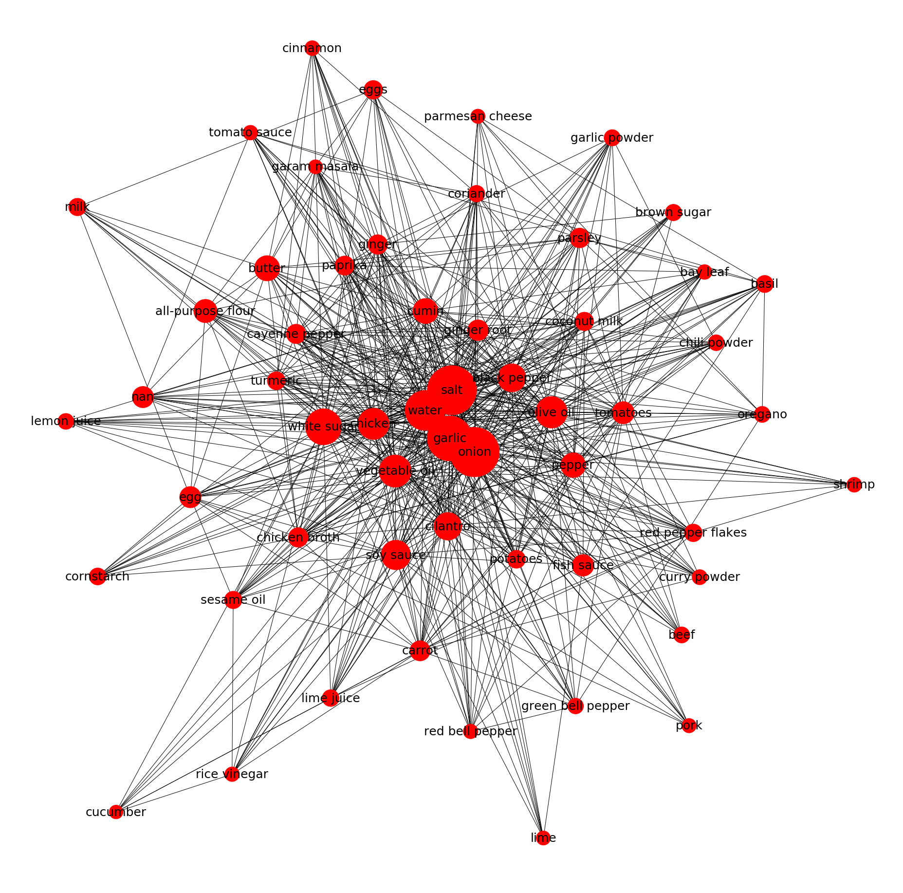

## Ingredient Network

This repository contains the steps and stages utilized to create an ingredient network. One can
view an ingredient network as a visualization of common ingredients in recipes. Each node
represents an ingredient, and a edge occurs between two nodes if the two ingredients occur in a recipe.

## Initial Steps
First a recipe scrapper was built, and was utilized on www.allrecipes.com. This collected various
amounts of metadata, but most importantly were the ingredients of the recipe.

Using an ingredient tagger found at: https://github.com/NYTimes/ingredient-phrase-tagger
the base ingredients were extracted from the recipe metadata. The model found here was trained on 100 thousand
rows provided by New York Times.

## Plotting Stages

Once the base ingredients were found, the next step was to take a count of how many times a specific
ingredient occurred in the list of recipes. These provided the weights to the graph, the higher the frequency
the larger the node in the graph is.

After the ingredients were split into combinations of two, this was to determine if an edge should be between
the two node ingredients. If the paired ingredients occurred together in a proportion of recipes, an edge was drawn
between the two.

## References
Paper for intial ideas can be found here: https://arxiv.org/pdf/1111.3919.pdf

